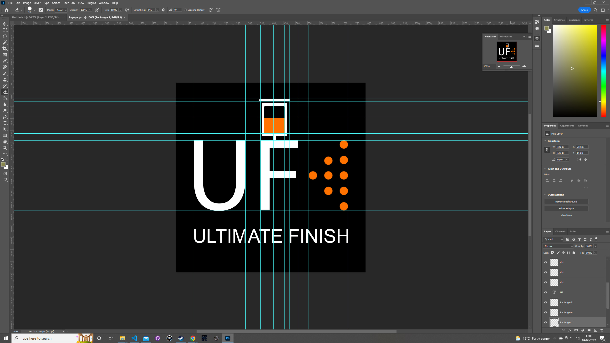
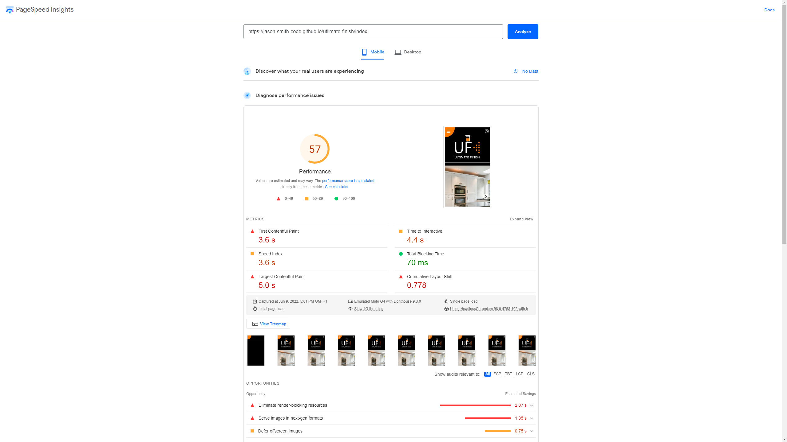
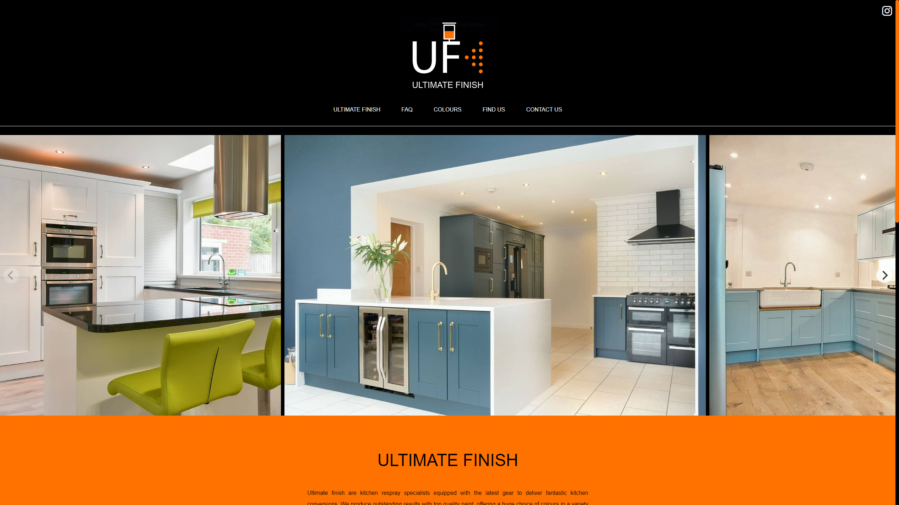
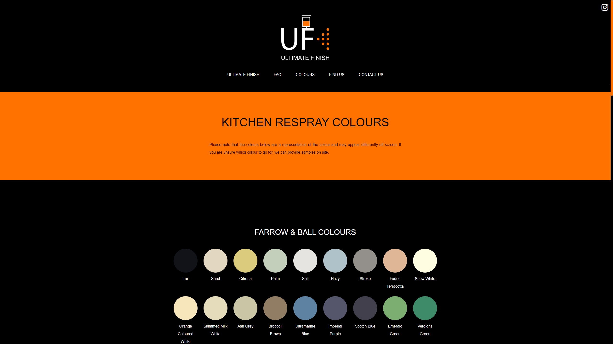
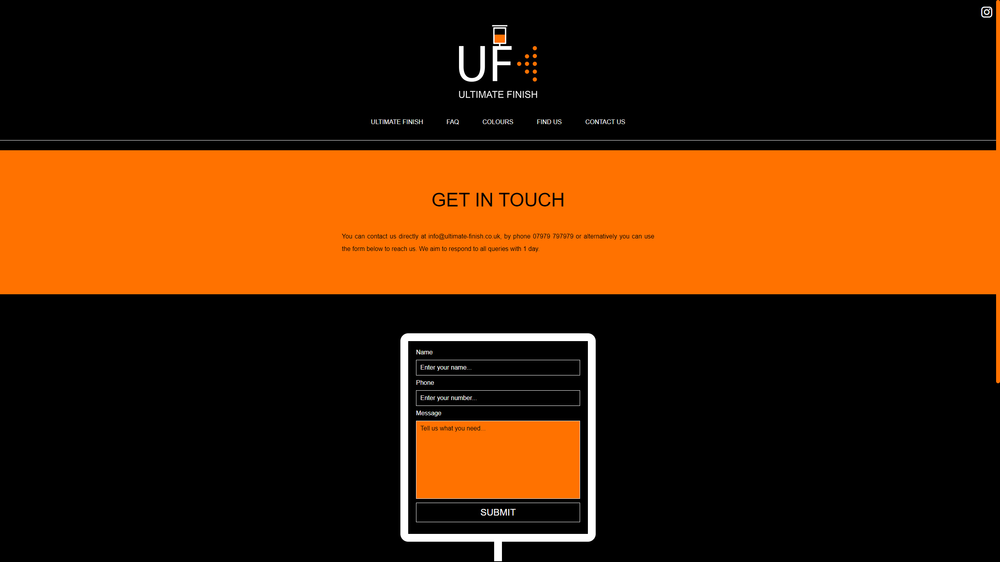
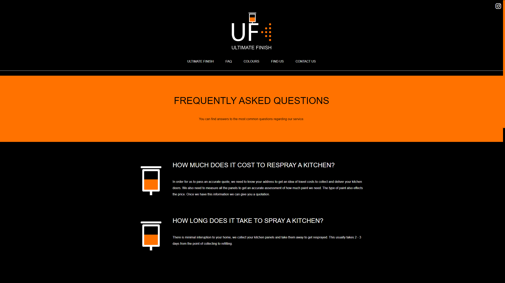
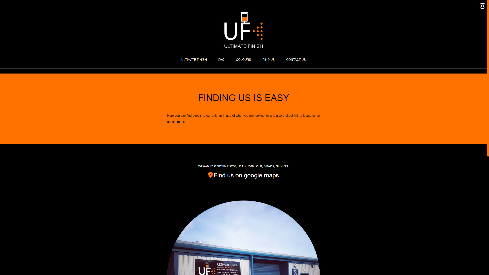

# Ultimate Finish : Website

👋 Hi, I’m @Jason-Smith-Code

👀 I’m interested in

- Programming (Javascript)
- Gaming ( RTS, FPS & ARPG's)

📫 How to reach me
https://www.linkedin.com/in/jason-smith-code/
👓 My portfolio site
https://www.jason-smith.tech

## Business Description

Ultimate Finish is a local business which specialising in kitchen respray. Unfortunately, during 2021 Ultimate finish ceased trading, but not for reasons you may assume.
The fact that this business was no longer trading presented a slight problem for research and content.
I was able to collect images from their instagram page, and I knew a bit about his business as he was based near me.
The owner is a perfectionist, he really cared about the presentation of his work and I hope to convey that through the website.

## Objective

To produce a modern, responsive and optimised website which showcases what the business does.
The webste will be easy to navigate, will contain a consistent theme which feels like it belongs to the brand.
The goal would be to convert visitors into customers through the display of high quality image assets featuring finished work.
A clear break down of what the business does and an easy way for the visitor to reach the busness by displaying a contact number, email and contact form.

## Result

I used his existing logo as a colour palette for the theme which strengthened his existing brand. The colours were great to work with and I feel they make a great impact.
I used flickty to showcase images of finished work on the landing page, being the first thing a visitor will see, I felt that a gallery would be a great starting point to keep the visitor engaged.
I used the idea or circles from his logo, drops of spray paint and converted this into expanding animations to tie in with his line of work, that being the transition of one colour to another.
I build up a array of objects containing colour data, then mapped through this array to render a css grid of all colours in the array. One of the attributes was a string containing a hexidecimal colour which
was fed into the render as inline css for the background of each colour.
For animation I used an inview trigger as the element enters the view port either a class or style change occurs on the element.

The owner of the business absolutely loved the final result.

## What was my Workflow

- **✅ Rebuild Logo**  
  The only logo I could find online was a tiny pixellated poor image, so I used this as reference and re-built the logo in photoshop.
  

- **✅ Publish on github Pagegs**  
  This allowed me to assess the site through speed testing facilities

- **Google Pagespeed**  

## Before page speed optimisaton

Page - index:  
Mobile Score: 67  
Desktop Score: 98  
Page - colours:  
Mobile Score: 99  
Desktop Score: 98  
Page - contact:  
Mobile Score: 81  
Desktop Score: 99  
Page - faq:  
Mobile Score: 84  
Desktop Score: 99  
Page - find-us:  
Mobile Score: 89  
Desktop Score: 98

## After page speed optimisaton

## Website screen Shots

Index page desktop

Colours page desktop

Contact page desktop

FAQ page desktop

Find us page desktop

## Viewing the website

Visit : https://jason-smith-code.github.io/ultimate-finish/index
